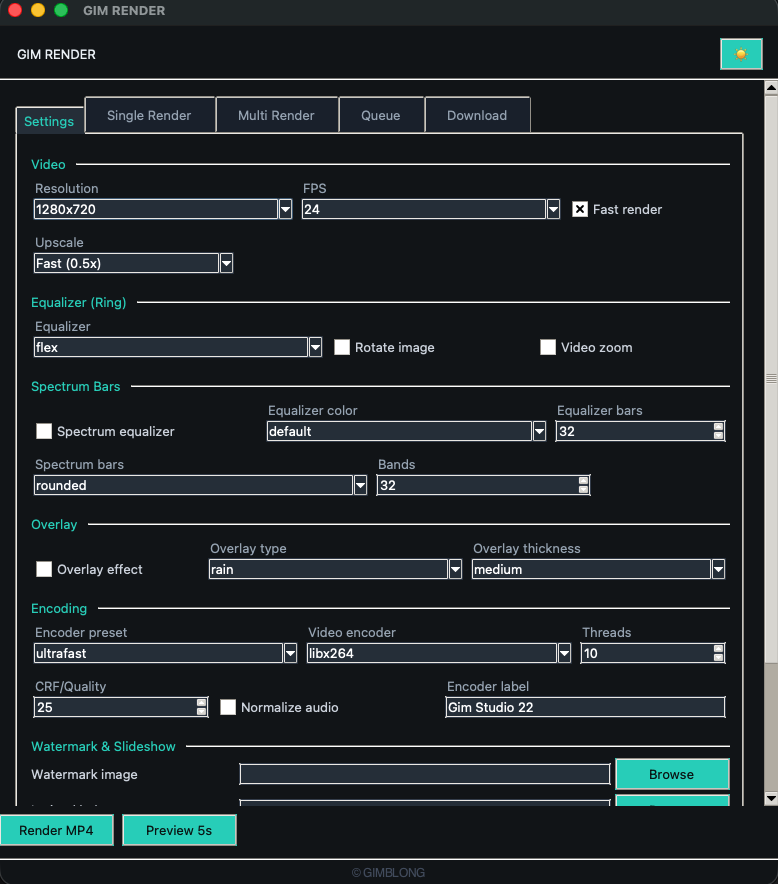

# GIM RENDER

Generate professional music visualizer videos from audio + cover image. Audio-reactive spectrum equalizer, overlay effects, lyrics sync, and YouTube download.

[](https://github.com/dikandonk/gim-render/releases/download/v1.6/gimrender.zip)



## Quick Start

### Windows
```bash
# Double-click run.bat — auto installs everything
# Or via terminal:
setup.bat
run.bat
```

### macOS / Linux
```bash
./setup.sh
./run.sh
```

One-click scripts auto-detect Python, FFmpeg, and install dependencies automatically.

## Manual Install

```bash
python3 -m venv .venv
source .venv/bin/activate   # macOS/Linux
# .venv\Scripts\activate    # Windows
pip install -r requirements.txt
```

Also requires **FFmpeg**: `brew install ffmpeg` (Mac) / `winget install ffmpeg` (Win) / `apt install ffmpeg` (Linux).

## Usage

```bash
# Single render
python main.py song.mp3 cover.jpg

# Desktop GUI (default)
python main.py --gui-tk
run.bat                    # Windows double-click

# Web GUI
python main.py --gui
run.bat web

# Folder batch
python main.py --folder assets
python main.py --folder assets --combine -o mix.mp4

# Multiple pairs
python main.py --pair song1.mp3 img1.jpg song2.mp3 img2.jpg

# With crossfade
python main.py --folder assets --combine --fade 2

# Lyrics sync
python main.py song.mp3 cover.jpg --lrc lyrics.lrc

# Watermark + slideshow
python main.py song.mp3 cover.jpg --watermark-image logo.png --image-duration 10 --extra-images img2.jpg img3.jpg

# WAV/FLAC/OGG audio input
python main.py song.wav cover.jpg
```

## CLI Flags

| Flag | Default | Description |
|------|---------|-------------|
| `--fps` | 24 | 24, 30, or 60 |
| `--resolution` | 1280x720 | 1920x1080, 854x480, etc |
| `--scale` | 0.5 | Internal render scale: 0.5 (fast), 0.75 (balanced), 1.0 (quality) |
| `--fast-render` | off | Skip heavy per-frame effects |
| `--crf` | 25 | 0 (lossless) - 51 (worst) |
| `--video-encoder` | libx264 | auto, libx264, h264_videotoolbox, etc |
| `--encoder-preset` | ultrafast | ultrafast through medium |
| `--threads` | CPU cores | FFmpeg encoder threads |
| `--bands` | 32 | 16-96 spectrum bands |
| `--equalizer-bars` | 32 | 8-128 visible bars |
| `--equalizer-style` | rounded | rounded, sharp, upward, line, mirror, waveform |
| `--equalizer-color` | default | cyan, pink, amber, green, purple, white, blue, red, orange, teal, violet, lime |
| `--image-effect` | flex | flex, bars, wave, dots, none (equalizer ring style) |
| `--rotate-image` | off | Rotate circular artwork |
| `--video-zoom` | off | Beat-reactive zoom effect |
| `--overlay true` | off | Rain/snow overlay effect |
| `--overlay-type` | rain | rain or snow |
| `--overlay-thickness` | medium | thin, medium, or thick |
| `--normalize` | off | 2-pass EBU R128 loudness normalization |
| `--watermark-image` | none | Logo/image at top-right corner |
| `--image-duration` | 0 | Switch artwork every N seconds (slideshow) |
| `--extra-images` | none | Additional artwork for slideshow |
| `--lrc` | none | Lyrics file (.lrc) for synced text |
| `--fade` | 0 | Crossfade duration between combined tracks |
| `--serial` | off | Disable parallel multi-core rendering |
| `--encoder-label` | Gim Studio 22 | Metadata encoder label |

## GUI Features

- **Single Render** — one MP3 + image
- **Multi Render** — batch folder with combine option
- **Queue** — custom MP3+image pairs
- **Download** — YouTube audio download + tempo 6x
- **Settings** — all video/visual/encoding options in one tab

### Visualizer Styles
**Equalizer Ring:** flex, bars, wave, dots, none  
**Spectrum Bars:** rounded, sharp, upward, line, mirror, waveform

### Extra Features
- Crossfade transitions between combined tracks
- Watermark image (auto-resized, top-right)
- Slideshow artwork with configurable interval
- .lrc lyrics sync with fade transitions
- YouTube download (yt-dlp) with optional tempo 6x
- Light/dark theme toggle (persisted)
- Render elapsed time display
- WAV, FLAC, OGG, M4A audio input support

## Requirements

- Python 3.10+
- FFmpeg
- pip: `moviepy`, `librosa`, `numpy`, `pillow`, `pillow-heif`, `mutagen`, `scipy`, `tqdm`, `yt-dlp`
